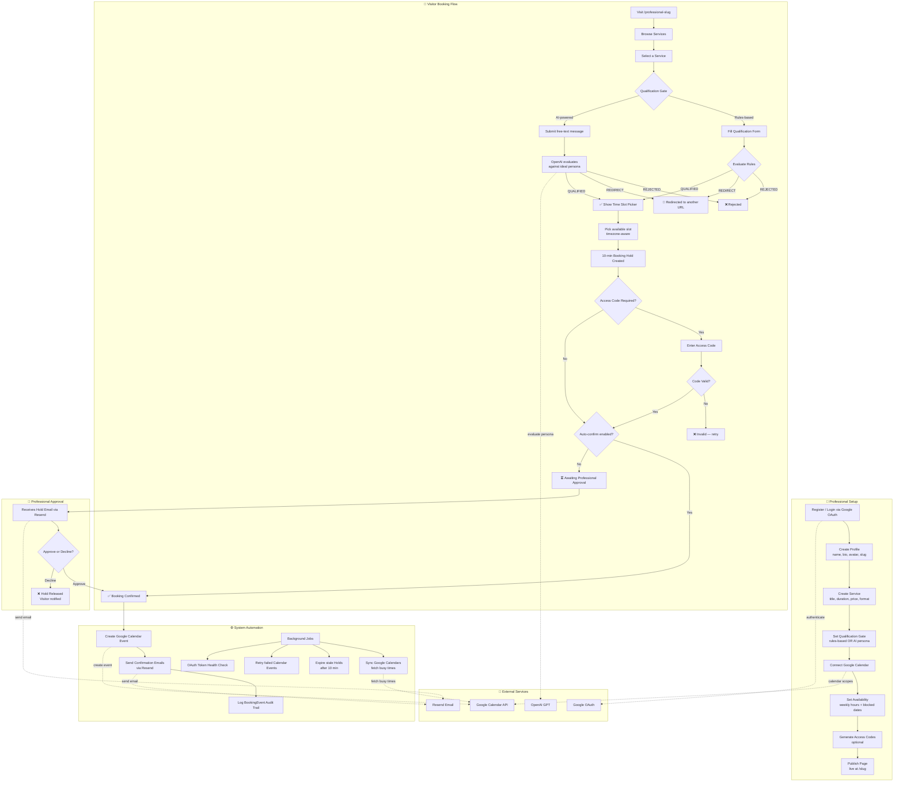

# Gate — Project Interaction Flowchart

```mermaid
flowchart TD
    subgraph PROFESSIONAL["👤 Professional Setup"]
        P1[Register / Login via Google OAuth] --> P2[Create Profile\nname, bio, avatar, slug]
        P2 --> P3[Create Service\ntitle, duration, price, format]
        P3 --> P4[Set Qualification Gate\nrules-based OR AI persona]
        P4 --> P5[Connect Google Calendar]
        P5 --> P6[Set Availability\nweekly hours + blocked dates]
        P6 --> P7[Generate Access Codes\noptional]
        P7 --> P8[Publish Page\nlive at /slug]
    end

    subgraph VISITOR["🧑 Visitor Booking Flow"]
        V1[Visit /professional-slug] --> V2[Browse Services]
        V2 --> V3[Select a Service]
        V3 --> V4{Qualification Gate}

        V4 -->|Rules-based| V5[Fill Qualification Form]
        V4 -->|AI-powered| V6[Submit free-text message]

        V5 --> V7{Evaluate Rules}
        V6 --> V8[OpenAI evaluates\nagainst ideal persona]

        V7 -->|REJECTED| V9[❌ Rejected]
        V7 -->|REDIRECT| V10[🔀 Redirected to another URL]
        V7 -->|QUALIFIED| V11[✅ Show Time Slot Picker]

        V8 -->|REJECTED| V9
        V8 -->|REDIRECT| V10
        V8 -->|QUALIFIED| V11

        V11 --> V12[Pick available slot\ntimezone-aware]
        V12 --> V13[10-min Booking Hold Created]

        V13 --> V14{Access Code Required?}
        V14 -->|Yes| V15[Enter Access Code]
        V15 --> V16{Code Valid?}
        V16 -->|No| V17[❌ Invalid — retry]
        V16 -->|Yes| V18{Auto-confirm enabled?}
        V14 -->|No| V18

        V18 -->|Yes| V19[✅ Booking Confirmed]
        V18 -->|No| V20[⏳ Awaiting Professional Approval]
    end

    subgraph APPROVAL["👤 Professional Approval"]
        V20 --> A1[Receives Hold Email via Resend]
        A1 --> A2{Approve or Decline?}
        A2 -->|Approve| V19
        A2 -->|Decline| A3[❌ Hold Released\nVisitor notified]
    end

    subgraph SYSTEM["⚙️ System Automation"]
        V19 --> S1[Create Google Calendar Event]
        S1 --> S2[Send Confirmation Emails\nvia Resend]
        S2 --> S3[Log BookingEvent Audit Trail]

        S4[Background Jobs] --> S5[Sync Google Calendars\nfetch busy times]
        S4 --> S6[Expire stale Holds\nafter 10 min]
        S4 --> S7[Retry failed Calendar Events]
        S4 --> S8[OAuth Token Health Check]
    end

    subgraph INTEGRATIONS["🔌 External Services"]
        I1[Google OAuth]
        I2[Google Calendar API]
        I3[OpenAI GPT]
        I4[Resend Email]
    end

    P1 -.->|authenticate| I1
    P5 -.->|calendar scopes| I2
    S1 -.->|create event| I2
    S5 -.->|fetch busy times| I2
    V8 -.->|evaluate persona| I3
    S2 -.->|send email| I4
    A1 -.->|send email| I4
```
